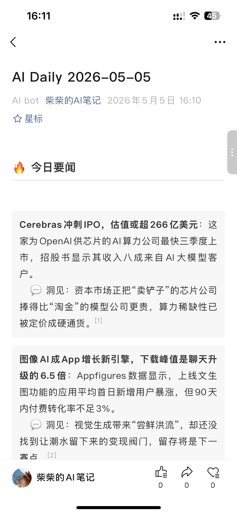
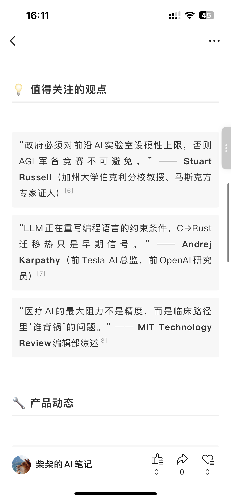
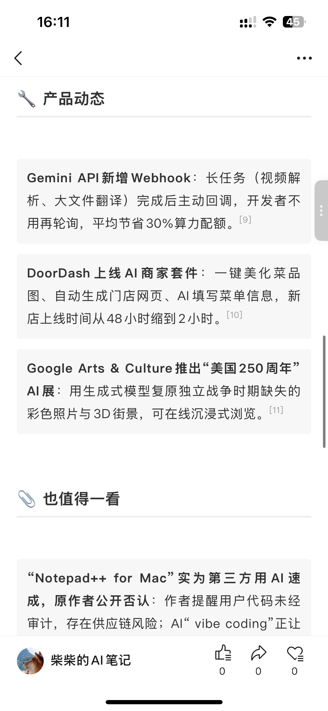

# AI Daily News

> A self-hosted AI news pipeline: pulls from RSS + X, dedupes across sources, lets an LLM curate a daily digest, optionally narrates it as a podcast, and publishes wherever you want.

[](LICENSE)

<p align="center">
  
  
  
</p>
<p align="center"><em>A daily digest published to a WeChat Official Account. Chinese by default — set <code>DIGEST_LANG=en</code> for English.</em></p>

**Why another news bot?**

- **Multi-source dedup with scoring** — three-layer dedup (URL → title similarity → summary similarity) and a recency-weighted score so the same story across 5 outlets becomes one cross-validated entry, not five.
- **Podcast audio out of the box** — every digest can ship as an MP3 generated by Podcastfy + Edge TTS.
- **Pluggable publishers** — local Markdown, WeChat Official Account, Telegram channel. Add your own in ~30 lines.
- **OpenAI-compatible LLM** — works with Moonshot, OpenAI, DeepSeek, OpenRouter, or anything else with the same API shape.

A sample digest lives at [`examples/sample-digest.md`](examples/sample-digest.md).

## Quickstart

```bash
git clone https://github.com/<you>/ai-daily-news && cd ai-daily-news
pip install -r requirements.txt
cp .env.example .env  # fill in LLM_API_KEY at minimum
python src/handler.py 24    # 24 = look back this many hours
```

The digest is written to `data/digest-YYYY-MM-DD.md`. With no publishers configured, that's the only output — perfect for piping into your own workflow.

### Docker

```bash
cp .env.example .env  # edit it
docker compose up
```

## Configure sources

- `config/feeds.yaml` — RSS feeds. Drop in any feed URL.
- `config/x_accounts.yaml` — X/Twitter handles with `weight: high|medium`. High-weight accounts get a 3× score multiplier.
- `config/sensitive_words.yaml` — Optional content filter (off by default; set `ENABLE_CONTENT_FILTER=1` to turn on; useful when republishing to Chinese platforms).

X collection needs `X_AUTH_TOKEN` and `X_CT0` cookies (grab them from your browser dev tools). Without these set, the pipeline runs RSS-only.

## Configure publishers

The pipeline will run every publisher whose env vars are configured. Restrict the list with `PUBLISHERS=markdown,telegram` if you want.

| Publisher | Env vars | Output |
|---|---|---|
| `markdown` | (always on) | `data/digest-YYYY-MM-DD.md` |
| `telegram` | `TELEGRAM_BOT_TOKEN`, `TELEGRAM_CHAT_ID` | Posts to channel, sends MP3 if generated |
| `wechat` | `WECHAT_APP_ID`, `WECHAT_APP_SECRET` | Creates a draft article (manual publish from backend) |

### Add your own

Drop a new module into `src/publisher/` exposing `NAME`, `is_configured()`, and `publish(digest_md, date_str, **kwargs)`, then register it in `src/publisher/__init__.py`. See `markdown_file.py` (~12 lines) as the minimal template.

## Schedule it

The repo ships with a GitHub Actions workflow at `.github/workflows/daily.yml` that runs daily at 00:00 UTC. Move your env vars into repo Secrets and you're done. For local cron / Cloud Run / etc., just call `python src/handler.py 24` on whatever schedule you like.

## Pipeline

```
collect (RSS + X)  →  score  →  dedup (URL / title / summary)  →  classify  →  sort
                                                                                  ↓
            ←  publish (markdown / wechat / telegram / …)  ←  audio (optional)  ←  LLM digest
```

Implementation details:
- `src/processor/preprocessor.py` — scoring uses `log2(engagement) × account_weight × time_decay(half_life=24h)`.
- `src/processor/generator.py` — LLM prompt lives in `prompts/digest_zh.md` / `prompts/digest_en.md`. Pick via `DIGEST_LANG`.
- `src/audio/podcast.py` — two-host Chinese podcast via Edge TTS. Set `DISABLE_AUDIO=1` to skip.

## License

MIT — see [LICENSE](LICENSE).
